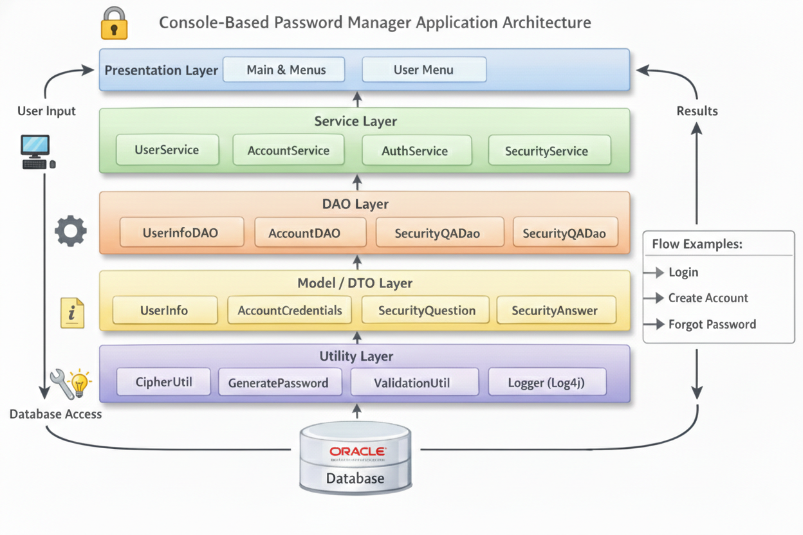
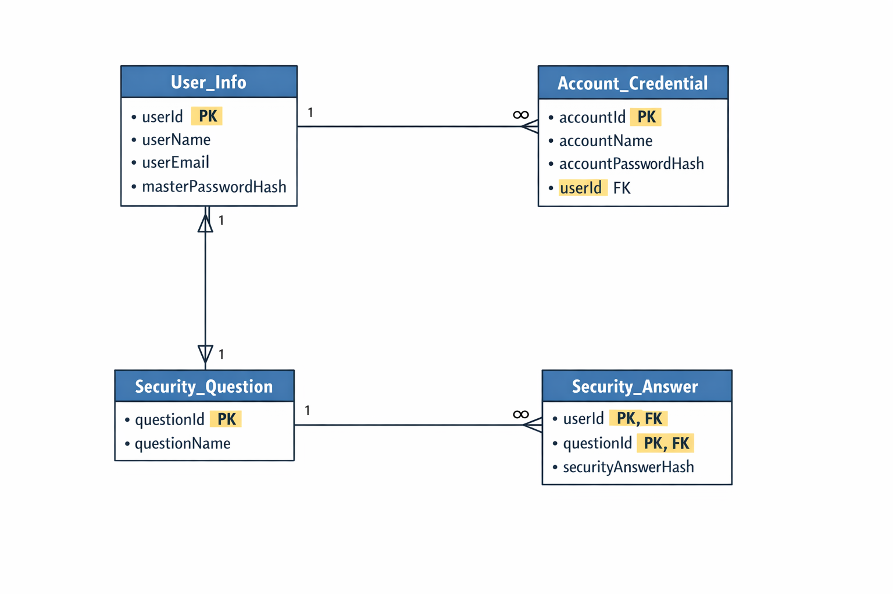

# Rev Password Manager – Console Application

Password Manager is a secure Java-based console application that helps users store and manage passwords for multiple online accounts.  
It uses a master password for authentication and encrypts stored credentials before saving them to the database.

---

## 📌 Application Overview

The system allows users to create a personal password vault, generate strong passwords, and safely maintain their credentials with additional security mechanisms such as verification codes and security questions.

---

## ✅ Core Features

Users can:

1. Create an account with a master password  
2. Log in securely  
3. Update profile details (name, email)  
4. Generate strong random passwords using custom rules  
5. Add new account credentials  
6. List all saved accounts and passwords  
7. View individual password details (requires master password re-entry)  
8. Update existing passwords  
9. Delete stored credentials  
10. Search passwords by account name  
11. Add security questions for account recovery  
12. Receive one-time verification codes for sensitive operations  
13. Manage security questions linked to their account  

---

## 🔐 Functional Scope

- Registered users can log in, change their master password, and recover forgotten passwords using security questions.  
- Passwords are encrypted before being stored in the database.  
- Master password is never saved in plain text.  
- Layered architecture ensures separation of concerns.

---

## 🧱 Project Architecture

Console UI
↓
Service Layer
↓
DAO Layer
↓
Database (MySQL / Oracle via JDBC)

- **UI Layer**: Handles menus and user input  
- **Service Layer**: Business logic, validation, encryption  
- **DAO Layer**: Database access  
- **Util Package**: DB connectors, encryption helpers, logging  
- **Log4j2**: Used for file-based logging only  

---

## 📂 Project Structure
```
RevPasswordManager/
├── pom.xml
├── src/
│   ├── main/
│   │   ├── java/
│   │   │   ├── com/passwordmanager/
│   │   │   │   ├── app/
│   │   │   │   │   └── App.java
│   │   │   │   ├── connection/
│   │   │   │   │   └── ConnectorFactory.java
│   │   │   │   ├── dao/
│   │   │   │   │   ├── AccountCredentialsDao.java
│   │   │   │   │   ├── SecurityAnswerDao.java
│   │   │   │   │   ├── SecurityQuestionDao.java
│   │   │   │   │   ├── UserInfoDao.java
│   │   │   │   │   └── implementation/
│   │   │   │   │       ├── AccountCredentialsDaoImp.java
│   │   │   │   │       ├── SecurityAnswerDaoImp.java
│   │   │   │   │       ├── SecurityQuestionDaoImp.java
│   │   │   │   │       └── UserInfoDaoImp.java
│   │   │   │   ├── dto/
│   │   │   │   │   ├── AccountCredentials.java
│   │   │   │   │   ├── SecurityAnswer.java
│   │   │   │   │   ├── SecurityQuestion.java
│   │   │   │   │   └── UserInfo.java
│   │   │   │   ├── service/
│   │   │   │   │   ├── account/
│   │   │   │   │   │   ├── AddAccountCredential.java
│   │   │   │   │   │   ├── DeleteAccountCredential.java
│   │   │   │   │   │   ├── UpdateAccountCredential.java
│   │   │   │   │   │   └── ViewAccountDetail.java
│   │   │   │   │   ├── login/
│   │   │   │   │   │   ├── LoginService.java
│   │   │   │   │   │   └── LogoutService.java
│   │   │   │   │   ├── password/
│   │   │   │   │   │   ├── GeneratePassword.java
│   │   │   │   │   │   └── PasswordService.java
│   │   │   │   │   ├── questions/
│   │   │   │   │   │   ├── ManageSecurityQuestions.java
│   │   │   │   │   │   └── SecurityQuestionService.java
│   │   │   │   │   └── user/
│   │   │   │   │       ├── UserService.java
│   │   │   │   │       └── UserProfileService.java
│   │   │   │   └── util/
│   │   │   │       ├── LoggerFactory.java
│   │   │   │       └── SimpleCipherUtil.java
│   └── test/
│       └── java/
│           └── com/passwordmanager/service/
│               ├── account/
│               │   ├── AddAccountCredentialTest.java
│               │   ├── DeleteAccountCredentialTest.java
│               │   ├── UpdateAccountCredentialTest.java
│               │   └── ViewAccountDetailTest.java
│               ├── login/
│               │   ├── LoginServiceTest.java
│               │   └── LogoutServiceTest.java
│               ├── password/
│               │   ├── GeneratePasswordTest.java
│               │   └── PasswordServiceTest.java
│               ├── questions/
│               │   ├── ManageSecurityQuestionsTest.java
│               │   └── SecurityQuestionServiceTest.java
│               └── user/
│                   ├── UserServiceTest.java
│                   └── UserProfileServiceTest.java

```
---


---
## 🗃️ ER Diagram (Database Design)


---
## 🛠️ Technologies Used

- Java  
- JDBC  
- MySQL / Oracle  
- Log4j2  
- JUnit  

---

## 📝 Logging

- Log4j2 is configured for **file-only logging**.  
- Console logging is disabled.  
- All important operations are written to:

/logs/passwordmanager.log

---

## ▶️ How to Run

1. Clone the repository  
2. Configure DB credentials in `ConnectorFactory.java`  
3. Run SQL scripts to create required tables  
4. Execute `Main.java`  
5. Use the console menus to operate the application  

---

## 🚀 Future Enhancements

- Web-based UI using Spring Boot  
- REST APIs  
- JWT authentication  
- Cloud-based secret storage  
- Password vault export/import  

---

## 👤 Author

Revanth Gowda R
Java | JDBC | Log4j2 | Backend Development
